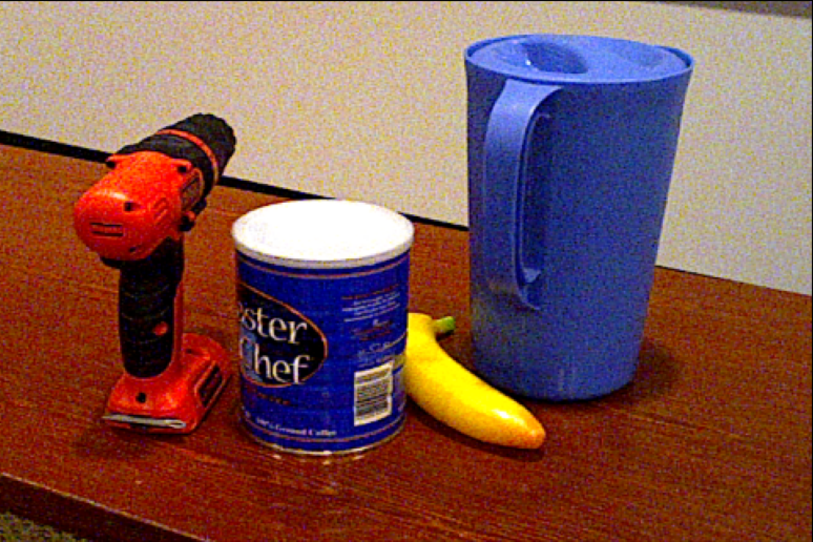
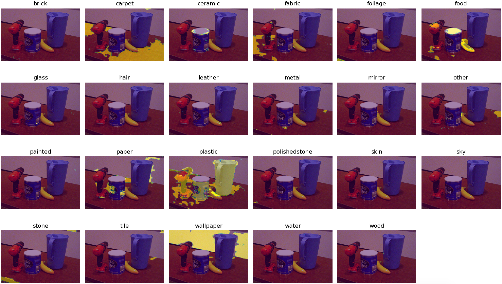

# Material Estimation
This is an unofficial implementation of this [paper](http://labelmaterial.s3.amazonaws.com/release/cvpr2015-minc.pdf) for material estimation. The authors has provided their model weights in Caffe while not the code for inference(which requires denseCRF for post processing). This repo converts their original Caffe model into PyTorch, then re-implement the denseCRF, shift-pooling and LRN(local response normalization). Note that the denseCRF used here is RGB based and the hyper-parameters are arbitrarily copied from this [repo](https://github.com/kazuto1011/deeplab-pytorch). Please check [here](https://www.philkr.net/code/) if you want to use the denseCRF mentioned in the paper

## Requirement
- [pydensecrf](https://github.com/lucasb-eyer/pydensecrf)
- [pytorch](https://pytorch.org/)
- opencv

## Model Convertion
Please use this [repo](https://github.com/vadimkantorov/caffemodel2pytorch) to convert the Caffe model into PyTorch. After the convertion, remember to squeeze the dimension of bias(from (1,1,1,K) -> (K)) and convert the fully connected layers to convolutional layers. Code example:

```
# Assuming that fc6.weight.size() == (1,1,4096,25088)
f['conv_fc6.weight'] = f['fc6.weight'].squeeze().view(4096,512,7,7)
f['conv_fc6.bias'] = f['fc6.bias'].squeeze()
```

An example of Googlenet after conversion is provided. Note that the Alexnet provided by the authors is not usable.

## Examples
| RGB Input | Material Prediction |
| ------------- | ------------- |
|   |   |

## Citation
```bash
@inproceedings{bell2015material,
  title={Material recognition in the wild with the materials in context database},
  author={Bell, Sean and Upchurch, Paul and Snavely, Noah and Bala, Kavita},
  booktitle={Proceedings of the IEEE conference on computer vision and pattern recognition},
  pages={3479--3487},
  year={2015}
}
```
